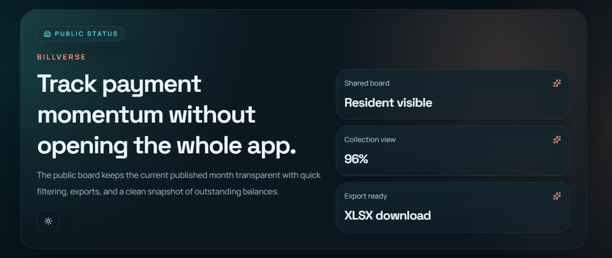
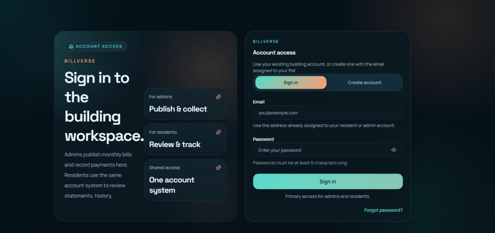
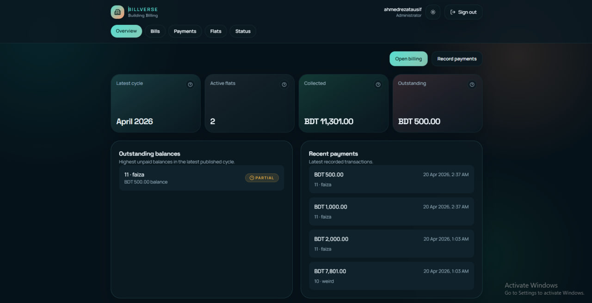
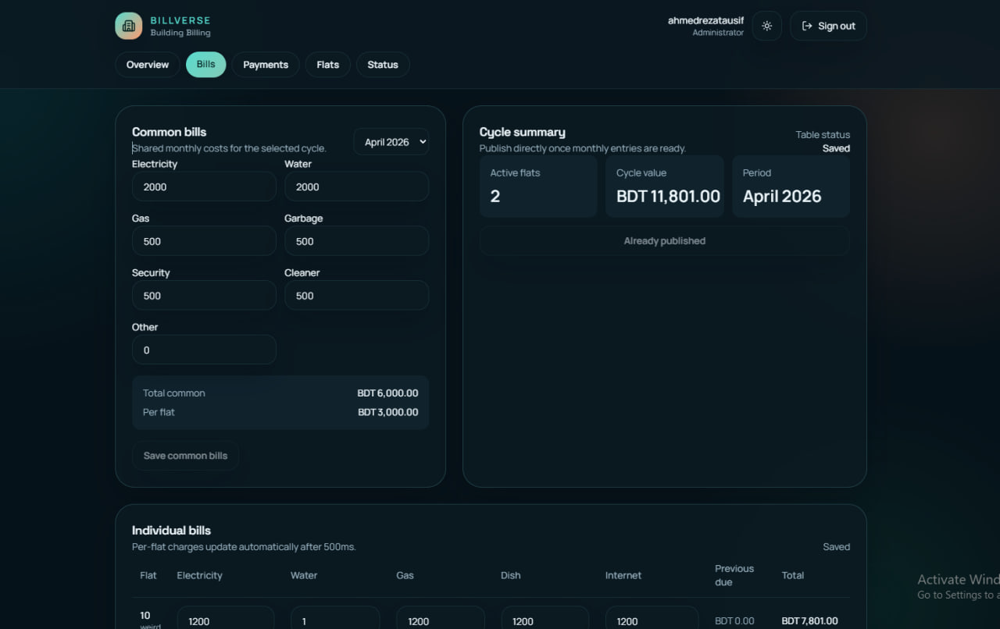
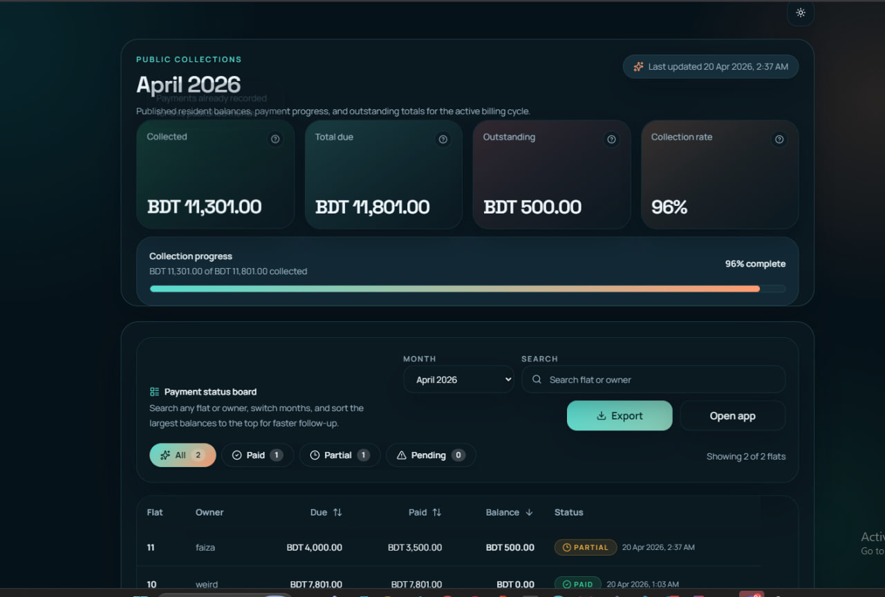

# BillVerse

BillVerse is a full-stack building billing workspace for apartment or flat-based communities. It gives administrators a clean monthly billing workflow and gives residents a simple place to review dues, payment history, notifications, PDFs, and a shareable public collection board.

It is built with Next.js 16, React 19, Tailwind CSS 4, and Supabase Auth + PostgreSQL.

## Why BillVerse

- Draft shared and per-flat monthly bills in one place
- Publish a billing cycle in one step
- Generate monthly statements automatically
- Record full or partial payments with notes and payment methods
- Notify residents when bills are published or payments are recorded
- Let residents review current dues, billing history, and notifications
- Export the public collection board to Excel
- Download statement PDFs for residents

## Product Screens

### Public status hero



### Login and account access



### Admin overview



### Admin billing workspace



### Public collections board



## Core Features

### Admin features

- Dashboard with latest cycle, collected total, outstanding amount, and recent payments
- Flat management with owner name, phone, resident email, and active billing status
- Shared monthly bill entry for electricity, water, gas, garbage, security, cleaner, and other charges
- Per-flat monthly bill entry for electricity, water, gas, dish, and internet charges
- Automatic statement generation during publish
- Payment recording with partial payments, notes, and payment method tracking
- Resident notifications after publishing bills
- Resident notifications after recording payments

### Resident features

- Shared sign-in and sign-up experience
- Email-confirmed Supabase Auth flow
- Current bill view with common, individual, and previous due breakdown
- PDF statement download
- Bill history screen
- Notification center with mark-all-as-read
- Password reset flow

### Public features

- Public collection board for the latest published billing cycle
- Search by flat or owner
- Filter by `All`, `Paid`, `Partial`, and `Pending`
- Sort by due, paid, or balance
- Excel export

## How The Product Works

BillVerse separates access by role:

- `admin`: manages flats, drafts bills, publishes monthly cycles, records payments
- `user`: views the assigned flat's statement, history, notifications, and payment activity

The high-level monthly workflow is:

1. Admin creates or updates flats and assigns resident email addresses.
2. Admin enters the common monthly costs.
3. Admin enters per-flat individual usage costs.
4. Admin publishes the billing cycle.
5. BillVerse generates monthly statements for every active flat.
6. BillVerse sends resident notifications that the new bill is ready.
7. Admin records payments over time.
8. BillVerse updates balances, statuses, and resident notifications automatically.

## Admin User Manual

### 1. Create the admin account

Before the first real login, create an admin in Supabase Auth and create the matching row in `public.users` with role `admin`.

Example SQL:

```sql
insert into public.users (id, role)
values ('YOUR_AUTH_USER_UUID', 'admin')
on conflict (id) do update set role = 'admin';
```

### 2. Sign in

Go to `/login` and sign in with the admin email and password. Successful admin login redirects to `/admin/dashboard`.

### 3. Manage flats

Open `/admin/flats` to add or edit flats.

Each flat can store:

- Flat number
- Owner name
- Phone number
- Resident email
- Active for billing toggle

Important rule:

- Add the resident email before the resident signs up so Supabase can link that account to the correct flat automatically.

### 4. Prepare a billing cycle

Open `/admin/bills/new`.

The billing workspace includes:

- `Common bills` section for building-wide charges
- `Monthly summary` with active flat count, cycle value, and publish button
- `Individual bills` table for per-flat charges

Behavior to know:

- Common charges can be saved manually with `Save common bills`
- Individual bill rows auto-save after about 500ms
- A published cycle becomes read-only in the billing workspace
- Per-flat totals include previous unpaid balance

### 5. Publish bills

When the month is ready, click `Publish bills`.

Publishing does all of the following:

- Calls the `publish_billing_cycle` SQL function
- Generates monthly statements for active flats
- Calculates common share automatically
- Carries forward unpaid previous balance
- Marks the selected common bill as published
- Creates resident notifications for the new cycle

### 6. Record payments

Open `/admin/payments`.

For each flat statement you can:

- Enter payment amount
- Choose payment method
- Add optional notes
- Save a payment using `Record payment`

BillVerse will:

- Prevent overpayment beyond the remaining balance
- Update `amount_paid`
- Recalculate `pending`, `partial`, or `paid` status
- Save the transaction to `payment_history`
- Notify the linked resident account

### 7. Monitor collections

Use two screens for monitoring:

- `/admin/dashboard` for a quick internal summary
- `/status` for the public collection board

The public board shows:

- Total billed
- Collected amount
- Outstanding amount
- Collection rate
- Search, filtering, sorting, and export

## Resident User Manual

### 1. Create an account

Go to `/login`, switch to `Create account`, and sign up with the exact email address assigned to the flat.

Requirements:

- The email must already exist on the flat record
- The password must be at least 8 characters
- The resident should confirm the account from the email received from Supabase

### 2. Sign in

After confirmation, sign in from `/login`. Residents are redirected to `/dashboard`.

### 3. Review the current bill

The resident dashboard shows:

- Current billing period
- Due date
- Total due
- Common charges
- Individual charges
- Previous due
- Payment status
- Download PDF button
- Recent notifications
- Recent payments

### 4. Download the statement PDF

From the current bill page, click `Download PDF`. BillVerse serves the statement document from:

```text
/api/statements/[statementId]/pdf
```

### 5. Review bill history

Open `/history` to see previous billing cycles with:

- Period
- Common share
- Individual total
- Previous due
- Total due
- Payment status

### 6. Read notifications

Open `/notifications` to see:

- Bill publication alerts
- Payment received alerts
- Timestamped updates

Residents can mark all notifications as read from the top action button.

### 7. Reset password

If the resident forgets their password:

1. Go to `/reset-password`
2. Enter the linked email address
3. Open the recovery email
4. Complete the new password form at `/reset-password/update`

## Public Status Board Guide

The public board is available at `/status`.

It is designed for transparent collection monitoring without requiring full app access.

Features:

- Latest published month summary
- Search by flat number or owner name
- Status filters with counts
- Sortable due, paid, and balance columns
- Mobile-friendly card layout
- Excel export
- `Open app` button for residents or admins who want to sign in

Best use cases:

- Sharing current collection progress with residents
- Reviewing unpaid balances quickly
- Exporting the visible month for reporting

## Installation Guide

### Prerequisites

- Node.js 20 or newer
- npm
- A Supabase project
- Optional: Vercel for deployment
- Optional: Vercel KV if you want external caching support

### 1. Clone and install

```bash
git clone <your-repo-url>
cd billVerse
npm install
```

### 2. Create local environment variables

Create `.env.local` in the project root.

Use `.env.example` as your template:

```bash
NEXT_PUBLIC_SITE_URL=http://localhost:3000
NEXT_PUBLIC_SUPABASE_URL=
NEXT_PUBLIC_SUPABASE_PUBLISHABLE_KEY=
SUPABASE_SERVICE_ROLE_KEY=
```

Optional:

- `NEXT_PUBLIC_SUPABASE_ANON_KEY` can be used as an alternative name for the publishable key
- `KV_REST_API_URL` and matching Vercel KV secrets can be added later if you enable KV-backed caching

### 3. Protect secrets before pushing to GitHub

This repository ignores `.env.*` files and other local secret files through `.gitignore`.

Safe to commit:

- `.env.example`

Never commit:

- `.env.local`
- `.env.production`
- `.env.development.local`
- `SUPABASE_SERVICE_ROLE_KEY`
- private certificate or key files

If a secret was ever committed in the past:

1. Rotate the secret in Supabase or your provider
2. Remove it from git history if needed
3. Commit the cleaned config

### 4. Apply the database schema

Run the Supabase migrations:

```bash
npx supabase login
npx supabase link --project-ref your-project-ref
npx supabase db push
```

Current migrations:

1. `0001_init.sql`
2. `0002_rls.sql`
3. `0003_auth_users.sql`
4. `0004_performance_indexes.sql`

### 5. Create the first admin

In Supabase:

1. Create the admin user in Authentication
2. Copy the auth user UUID
3. Insert the matching `public.users` row with role `admin`

### 6. Start the app

```bash
npm run dev
```

Open:

- `http://localhost:3000/login` for authentication
- `http://localhost:3000/status` for the public board

### 7. First-time app checklist

1. Sign in as admin
2. Add flats and resident emails
3. Create a draft month in the billing workspace
4. Save common bills
5. Fill per-flat individual bills
6. Publish the month
7. Record at least one payment
8. Verify resident dashboard, history, notifications, PDF, and public status board

## Environment Variables

| Variable | Required | Purpose |
| --- | --- | --- |
| `NEXT_PUBLIC_SITE_URL` | Recommended | Base URL for auth redirects and links |
| `NEXT_PUBLIC_SUPABASE_URL` | Yes | Supabase project URL |
| `NEXT_PUBLIC_SUPABASE_PUBLISHABLE_KEY` | Yes, unless using anon alias | Browser-safe Supabase key |
| `NEXT_PUBLIC_SUPABASE_ANON_KEY` | Optional alternative | Fallback alias for the publishable key |
| `SUPABASE_SERVICE_ROLE_KEY` | Yes | Server-only admin access for status and secure server operations |
| `KV_REST_API_URL` | Optional | Enables Vercel KV-backed cache helpers |

## Scripts

```bash
npm run dev
npm run build
npm run start
npm run lint
```

## Project Structure

```text
app/                   Next.js App Router pages and API routes
components/            Admin, resident, shared, and UI components
lib/                   Auth, data access, cache, utilities, validators
supabase/migrations/   Database schema and RLS migrations
docs/                  Deployment notes and screenshots
types/                 Shared TypeScript domain types
```

## Deployment Notes

- Configure the same environment variables in Vercel
- Keep `SUPABASE_SERVICE_ROLE_KEY` server-only
- Set the correct redirect URLs in Supabase Auth
- Review [docs/PRODUCTION_SETUP.md](./docs/PRODUCTION_SETUP.md) before production launch

## Security Notes

- Supabase service role keys must never be sent to the browser
- Do not commit local env files
- Use `.env.example` as the only committed template
- Prefer GitHub secret scanning and private repository settings when possible

## Tech Stack

- Next.js 16 App Router
- React 19
- Tailwind CSS 4
- Supabase Auth
- Supabase PostgreSQL
- TanStack React Query
- `@react-pdf/renderer`
- `xlsx`
